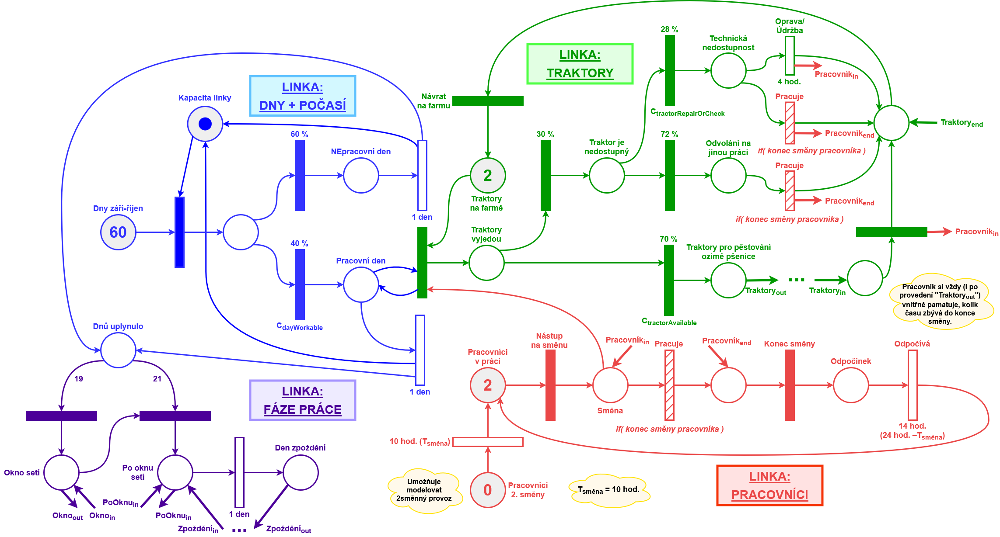
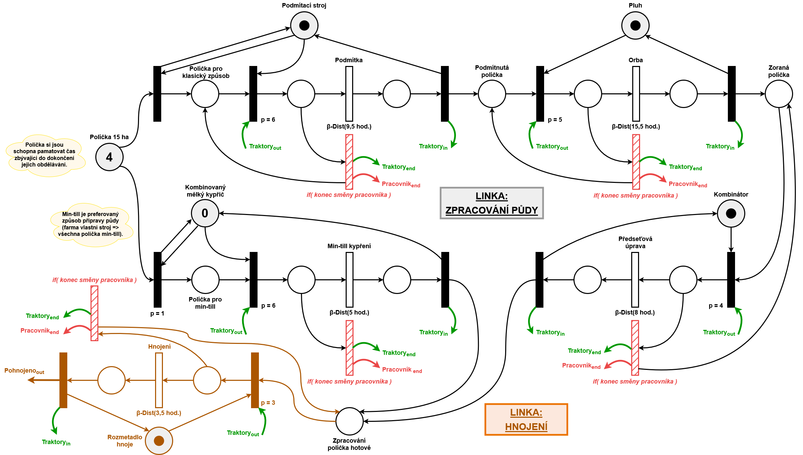
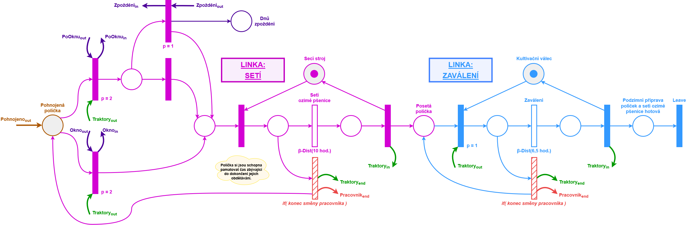

<div align="center">

# IMS – Project: Simulation Study

## Agricultural Queuing System

### Finding bottlenecks in winter wheat cultivation through discrete-event simulation

A stochastic **C++ simulation of autumn field operations** that explores how weather, machinery, labour, and cultivation strategy affect a farm's ability to finish its work on time — and remain profitable.

[](src/main.cpp)
[](https://www.fit.vut.cz/person/peringer/public/SIMLIB/.en)
[](#getting-started)
[](LICENSE)

**Brno University of Technology · Faculty of Information Technology · IMS (Modeling and Simulation) · 2025**

[Overview](#overview) · [How it works](#how-it-works) · [Results](#experimental-results) · [Get started](#getting-started) · [Documentation](#documentation) 

</div>

---

## About the authors and project

Developed as a **two-person university team project** for **IMS — Modeling and Simulation**, Faculty of Information Technology, **Brno University of Technology**, 2025.

**Result:** 20.0/20.0 b.

| **Name**             |  **xlogin**  | **Nickname** | **Contact**                   |
|:--------------------- |:------------:|:-------------:|:-----------------------------:|
| **Kalina Jan**        | `xkalinj00`  | Honziksick    | `xkalinj00@stud.fit.vutbr.cz` |
| **Krejčí David**      | `xkrejcd00`  | DJmDavidus    | `xkrejcd00@stud.fit.vutbr.cz` |

This repository is released under the **GNU General Public License v3.0**. See [LICENSE](LICENSE) for the full license text. SIMLIB/C++ is an external dependency distributed under its own license.

## Overview

**What limits the amount of winter wheat a farm can cultivate before the season runs out?** Is the solution to buy more equipment, hire extra workers, or change the cultivation process itself?

This project investigates those questions using a **discrete-event, stochastic queuing-system model** of autumn fieldwork. It represents individual fields moving through agricultural operations while competing for a limited pool of tractors, machines, and operators. Weather determines whether fieldwork is possible, while random equipment availability and operation durations introduce uncertainty.

The model was implemented in **C++ with [SIMLIB/C++](https://www.fit.vut.cz/person/peringer/public/SIMLIB/.en)** and evaluated through repeated simulation runs. Its conceptual design is documented using **Petri nets**.

### Key capabilities

- **Resource-constrained scheduling:** fields compete for tractors, agricultural machinery, and workers.
- **Two cultivation strategies:** conventional plowing and reduced-tillage (*min-till*) workflows.
- **Stochastic conditions:** variable workable days, tractor unavailability, repairs, and operation durations.
- **Shift-based operations:** configurable first- and second-shift staffing with working and rest periods.
- **Economic evaluation:** estimated revenue, operating and material costs, delayed-sowing losses, and net profit.
- **Reproducible experiments:** 12 built-in scenarios, each evaluated over 1,000 seeded replications.
- **Exportable results:** consolidated CSV metrics and detailed per-scenario text reports.

## How it works

The simulator models each field as a sequence of agricultural operations. A worker first checks the weather and tractor availability, then selects an eligible field and acquires the required machine. Operations consume simulated time, can continue across shifts, and contribute to operating costs. The model stops when all fields are finished or the configured time horizon is reached.


### Cultivation workflows

| Conventional tillage | Reduced tillage (*min-till*) |
| --- | --- |
| Stubble cultivation | Reduced soil cultivation |
| Plowing | — |
| Seedbed preparation | — |
| Fertilization | Fertilization |
| Sowing | Sowing |
| Rolling | Rolling |

The choice of workflow determines the number and duration of operations and, consequently, the demand for scarce machinery and working time. Scenario configurations can also assign a higher chemical-protection cost to *min-till*.

### Conceptual model: Petri nets

The original conceptual design is divided into three related modules. The diagrams are available both as images and as editable `.drawio` files.

<details open>
<summary><strong>1. Resources, workers, weather, and working periods</strong></summary>

<br>



[Open the editable diagram](diagrams/AgroPetriNet_Resources.drawio)

</details>

<details>
<summary><strong>2. Field preparation</strong></summary>

<br>



[Open the editable diagram](diagrams/AgroPetriNet_FieldPreparation.drawio)

</details>

<details>
<summary><strong>3. Sowing and cultivation</strong></summary>

<br>



[Open the editable diagram](diagrams/AgroPetriNet_Cultivation.drawio)

</details>

### Default simulation setup

| Parameter | Default |
| --- | ---: |
| Number of fields | 4 |
| Area per field | 15 ha |
| Total modeled area | 60 ha |
| Tractors | 2 |
| Workers (first / second shift) | 2 / 0 |
| Shift duration | 10 hours |
| Maximum simulation horizon | 60 days |
| Probability of a workable day | 40% |
| Probability of tractor unavailability | 30% |
| Potential wheat yield | 6.5 t/ha |
| Wheat price | 4,800 CZK/t |
| Revenue reduction from late sowing | 1% per day beyond the modeled threshold |

Defaults are declared in [`src/config.h`](src/config.h). Individual scenarios override them through `SimConfig` in [`src/main.cpp`](src/main.cpp).

## Experimental results

The study evaluates how the farm behaves as the cultivated area expands, whether extra machinery removes production bottlenecks, and whether switching to *min-till* improves the outcome.

### Selected findings

The following figures are **results reported in the accompanying 2025 simulation study**, based on 1,000 replications per scenario. Success denotes a simulation in which all modeled fields are completed before the simulation ends; profit is the modeled average, not observed farm income.

| Scenario | Cultivation strategy | Area | Successful runs | Average profit |
| --- | --- | ---: | ---: | ---: |
| `A_Baseline_4F` | Conventional | 60 ha | **94.7%** | **547,517 CZK** |
| `B_Medium_6F` | Conventional | 90 ha | 52.0% | 460,760 CZK |
| `C_High_8F` | Conventional | 120 ha | 4.5% | −609,975 CZK |
| `F_MinTill_High` | Min-till | 120 ha | **97.5%** | **1,572,062 CZK** |
| `G_MinTill_RealCost` | Min-till, +50% chemical costs | 120 ha | **97.9%** | **1,450,300 CZK** |

**What the simulations suggest:**

1. **Conventional cultivation reaches its capacity quickly.** Expanding from 4 to 8 fields dramatically reduces the model's completion rate.
2. **More implements alone do not resolve the bottleneck.** Duplicating the sowing equipment or the plowing/seedbed-preparation machinery provides only small improvements when tractor availability and sequential operations remain limiting factors.
3. **Changing the process is more effective than duplicating equipment.** In the modeled 8-field setup, *min-till* significantly improves both completion rates and estimated profitability, including when additional chemical costs are considered.

These findings apply to the **model's assumptions and tested configurations**; they are not universal recommendations for real farms. See the [full study](dokumentace.pdf) for methodology, assumptions, and detailed interpretation.

<details>
<summary><strong>All 12 experimental scenarios</strong></summary>

| Scenario | Research focus |
| --- | --- |
| `A_Baseline_4F` | Reference farm: 4 fields, conventional tillage |
| `B_Medium_6F` | Increased area: 6 fields |
| `C_High_8F` | High load: 8 fields |
| `D_Double_Sower` | Two sowing machines at high load |
| `E_Double_PlowPrep` | Two plows and two seedbed-preparation machines |
| `F_MinTill_High` | Reduced tillage at high load |
| `G_MinTill_RealCost` | Reduced tillage with 50% higher chemical costs |
| `H_Lean_Ops` | One-tractor operation |
| `I_Heavy_Shift` | More tractors and an additional worker shift |
| `J_Risk_Weather` | Only 25% workable days |
| `K_Risk_MachineFail` | 60% probability of tractor unavailability |
| `L_Super_Farm` | 12 fields, four tractors, two shifts, and min-till |

All scenarios are defined in `main()` in [`src/main.cpp`](src/main.cpp); they are executed automatically when the simulator starts.

</details>

## Getting started

### Prerequisites

- **GNU/Linux** (the project was developed and tested on Ubuntu 24.04.3 LTS).
- **G++** and **GNU Make**.
- **[SIMLIB/C++](https://www.fit.vut.cz/person/peringer/public/SIMLIB/.en)**, with the `simlib.h` header and the `simlib` library available to the compiler and linker. The study used **version 3.09**.
- The `column` command if you want the formatted summary printed by `make run`.

On Ubuntu, the standard build tools and the optional formatting utility can be installed with:

```bash
sudo apt update
sudo apt install build-essential bsdextrautils
```

**SIMLIB/C++ is a separate dependency and is not bundled with this repository.** Download it from the [official SIMLIB source archive](https://www.fit.vut.cz/person/peringer/public/SIMLIB/source/) and install it according to its distribution instructions. Ensure its headers and libraries are in locations searched by `g++` (or configure the appropriate include/library paths).

### Build and run

From the repository root:

```bash
# Compile the simulator
make

# Run all experiment batches
./simulation

# Alternatively: compile, execute, and print the CSV as a table
make run
```

The executable is created as `./simulation`. There is no interactive interface or command-line argument parser: running it executes the **12 predefined scenarios**, with **1,000 replications per scenario** by default.

To remove generated artifacts:

```bash
make clean
```

> **Changing the experiments:** Edit `Defaults` or `SimConfig` in `src/config.h`, or adjust the scenarios / `ITERATIONS` constant in `src/main.cpp`. When you change a header, run `make -B` (or `make clean && make`) to force a rebuild; the supplied Makefile does not automatically track header dependencies.

### Generated output

The program creates an `out/` directory containing:

```text
out/
├── test_results.csv             # Aggregated results for all scenarios
├── detail_A_Baseline_4F.txt     # Example detailed report (first run of a scenario)
├── detail_B_Medium_6F.txt       # One detail report per scenario
├── ...
└── internal_simlib.log          # SIMLIB output log
```

Each row in `test_results.csv` describes a scenario and includes its number of runs, completion rate, unfinished fields, mean/min/max profit, revenue, expenses, losses, equipment utilization, weather-related metrics, and run duration. Detailed reports provide field-level production and financial breakdowns for the first replication of each scenario.

For example, on systems with the `column` utility:

```bash
column -t -s, out/test_results.csv
```

## Project structure

```text
.
├── src/
│   ├── main.cpp                 # Simulation processes, experiments, and reporting
│   ├── config.h                 # Default parameters and scenario configuration
│   └── farm_classes.h           # Fields, statistics, and simulation context
├── diagrams/
│   ├── AgroPetriNet_Resources.*
│   ├── AgroPetriNet_FieldPreparation.*
│   └── AgroPetriNet_Cultivation.*
├── doc/
│   ├── dokumentace.tex          # LaTeX source of the simulation study
│   ├── Literatura/              # Bibliography and citation style
│   └── Makefile                 # Documentation build rules
├── dokumentace.pdf              # Complete simulation study (Czech)
├── notes/                       # Background research notes
├── info/                        # Course materials
├── Makefile                     # Application build and run targets
├── LICENSE
└── README.md
```

## Documentation

The accompanying academic report describes the agricultural background, modeling assumptions, Petri-net design, implementation, experimental scenarios, and results in greater depth.

- **[Read the complete simulation study (PDF, Czech)](dokumentace.pdf)**
- **[View its LaTeX source](doc/dokumentace.tex)**
- **[Browse the conceptual diagrams](diagrams/)** — PNG previews and editable draw.io sources
- **[SIMLIB/C++ — official project page](https://www.fit.vut.cz/person/peringer/public/SIMLIB/.en)**

### Scope and limitations

This is a **teaching and research simulation**, not farm-management software or an agronomic prediction service. Weather and machine availability are probabilistic; operation times, costs, and yield assumptions are simplified and scenario-dependent. Financial results represent model estimates. The full report discusses the assumptions underlying the experiments.
